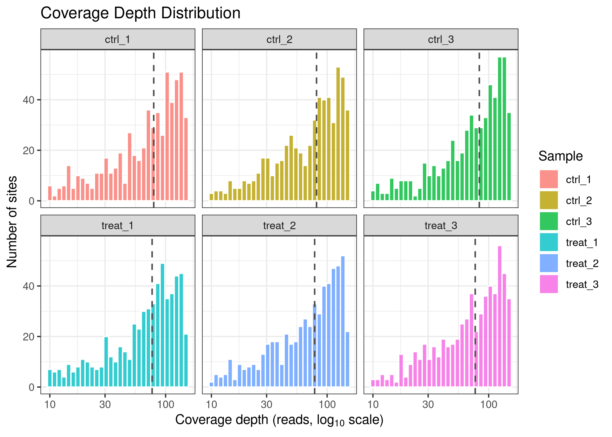
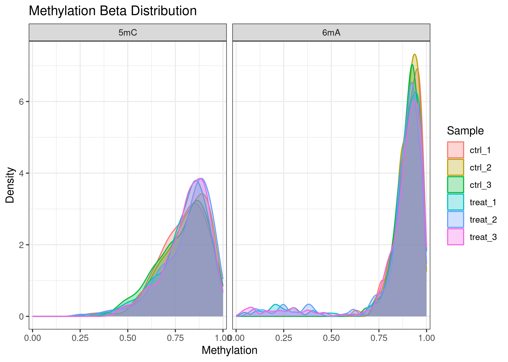
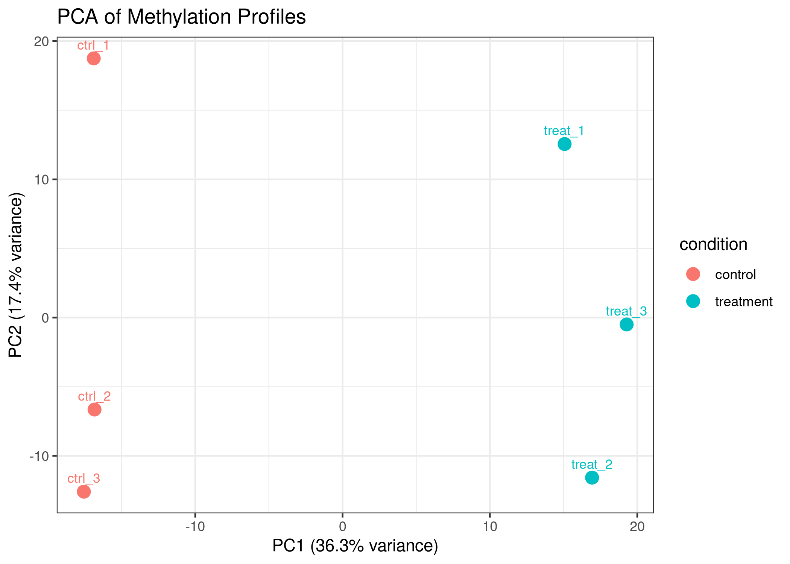
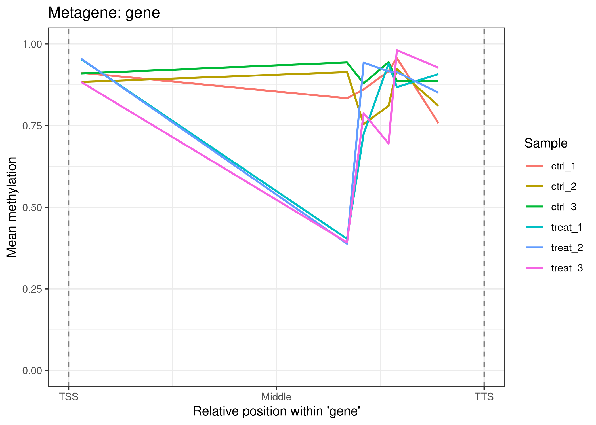
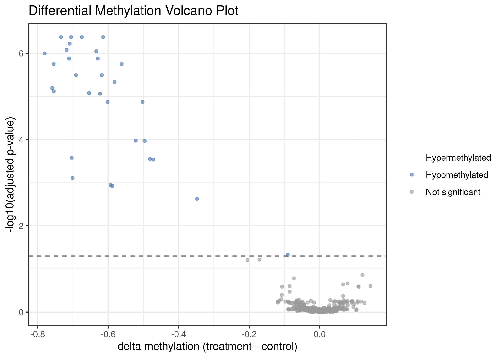
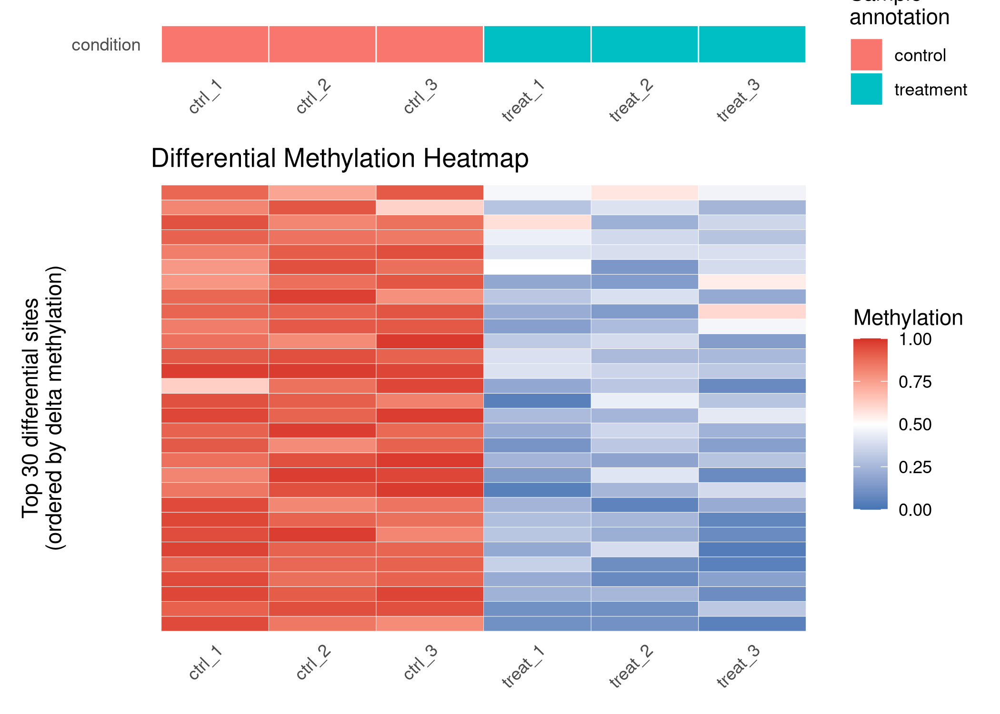

<!-- README.md is generated from README.Rmd. Please edit that file -->

# commaKit

<!-- badges: start -->

[](https://github.com/carl-stone/commaKit/actions/workflows/R-CMD-check.yaml)
<!-- badges: end -->

**commaKit** (**Com**parative **M**icrobial **M**ethylomics **A**nalysis
**Kit**) is an R/Bioconductor-style package for comparative analysis of
bacterial DNA methylation from Oxford Nanopore sequencing data.

commaKit starts from per-sample methylation evidence - usually modkit
pileup bedMethyl files - and builds a `commaData` object, an S4 class
extending `RangedSummarizedExperiment`. From that shared container, the
package supports quality control, genomic annotation, differential
methylation testing, region-level summaries, enrichment analysis,
export, and visualization for 6mA, 5mC, and 4mC methylation in monoploid
microbial genomes.

commaKit is under active development and is **not yet on Bioconductor**.
Install from GitHub for now.

## Why commaKit?

Nanopore methylation callers can report rich modified-base evidence, but
most analysis workflows still leave users to reconcile caller-specific
formats, coverage filters, genome coordinates, methylation contexts,
sample metadata, and downstream statistics by hand. commaKit provides
one R-native container and a coherent workflow for comparative microbial
methylomics:

- import modkit, Dorado, or Megalodon output into a single `commaData`
  object;
- keep raw methylation and count evidence together with genomic ranges
  and sample metadata;
- analyze methylation by modification context, such as `6mA_GATC` or
  `5mC_CCWGG`;
- test for differential methylation with `methylKit`, `limma`, or a
  native quasi-binomial F-test backend;
- annotate methylation sites to genes or other genomic features;
- summarize sites over regions and export BED-compatible tracks;
- visualize coverage, beta distributions, PCA, genome tracks,
  metagene/TSS profiles, volcano plots, and heatmaps.

The package is designed for bacterial and archaeal genomes where
methylation is often motif-associated, strand-aware, and close to fully
methylated or unmethylated at individual sites.

## Installation

``` r
# Install the development version from GitHub.
# commaKit is not yet on Bioconductor.
if (!requireNamespace("devtools", quietly = TRUE)) {
  install.packages("devtools")
}
devtools::install_github("carl-stone/commaKit")
```

## Input contract

commaKit is intentionally strict about the evidence it imports. The most
common path is modkit pileup bedMethyl:

- Use complete modkit pileup bedMethyl files, not generic BED-like
  tables.
- Preserve tab-delimited bedMethyl structure so blank required fields
  are not shifted into the wrong columns.
- For modkit input, `Nvalid_cov`, `Nmod`, `Ncanonical`, and `Nother_mod`
  are the authoritative count fields. Methylation beta values are
  computed from `Nmod / Nvalid_cov`, not from the derived
  `fraction_modified` percentage.
- Genome names must match imported methylation chromosomes. If the
  methylation files contain chromosomes absent from `genome`,
  construction stops with a clear error instead of guessing.
- Direct Dorado BAM parsing requires mapped BAM files with MM/ML tags
  preserved; in practice, many users will prefer to run modkit first and
  import the resulting bedMethyl files.

A typical `commaData()` call needs a named vector of per-sample files, a
sample metadata table, genome lengths or a FASTA/BSgenome, and
optionally annotation and motif information:

``` r
library(commaKit)

files <- c(
  ctrl_1  = "path/to/ctrl_rep1.bed",
  ctrl_2  = "path/to/ctrl_rep2.bed",
  ctrl_3  = "path/to/ctrl_rep3.bed",
  treat_1 = "path/to/treat_rep1.bed",
  treat_2 = "path/to/treat_rep2.bed",
  treat_3 = "path/to/treat_rep3.bed"
)

col_data <- data.frame(
  sample_name = names(files),
  condition = c("control", "control", "control",
                "treatment", "treatment", "treatment"),
  replicate = c(1L, 2L, 3L, 1L, 2L, 3L)
)

obj <- commaData(
  files = files,
  colData = col_data,
  genome = "path/to/genome.fa",
  annotation = "path/to/genes.gff3",
  motif = "GATC",
  min_coverage = 5L,
  caller = "modkit"
)
```

For import details and common failure modes, see
`vignette("import-troubleshooting", package = "commaKit")`.

## Quick start with example data

commaKit includes a small synthetic dataset for examples and tests. It
contains 588 methylation sites across six samples on a 100 kb toy
chromosome: 393 6mA/GATC sites and 195 5mC/CCWGG sites.

``` r
library(commaKit)
data(comma_example_data)
comma_example_data
#> class: commaData
#> sites: 588 | samples: 6
#> mod types: 5mC, 6mA
#> motifs: CCWGG, GATC
#> mod contexts: 5mC_CCWGG, 6mA_GATC
#> conditions: control, treatment
#> genome: 1 chromosome (100,000 bp total)
#> annotation: 5 features
#> motif sites: none
#> caller: modkit
#> min_coverage: 5
```

The core accessors expose sample metadata, genomic site metadata,
modification contexts, beta values, coverage, and raw count assays:

``` r
modContexts(comma_example_data)
#> [1] "5mC_CCWGG" "6mA_GATC"
sampleInfo(comma_example_data)[, c("sample_name", "condition", "replicate")]
#>         sample_name condition replicate
#> ctrl_1       ctrl_1   control         1
#> ctrl_2       ctrl_2   control         2
#> ctrl_3       ctrl_3   control         3
#> treat_1     treat_1 treatment         1
#> treat_2     treat_2 treatment         2
#> treat_3     treat_3 treatment         3
dim(methylation(comma_example_data))
#> [1] 588   6
dim(siteCoverage(comma_example_data))
#> [1] 588   6
```

## Standard workflow

### 1. Quality control

Start by checking per-sample methylation distributions and coverage.

``` r
ms <- methylomeSummary(comma_example_data)
ms[, c(
  "sample_name", "condition", "mean_beta", "median_beta",
  "frac_methylated", "n_covered"
)]
#>   sample_name condition mean_beta median_beta frac_methylated n_covered
#> 1      ctrl_1   control 0.8654839   0.8929141       0.9897959       588
#> 2      ctrl_2   control 0.8705692   0.8959600       0.9948980       588
#> 3      ctrl_3   control 0.8638033   0.8918851       0.9897959       588
#> 4     treat_1 treatment 0.8357998   0.8864176       0.9421769       588
#> 5     treat_2 treatment 0.8369054   0.8893089       0.9404762       588
#> 6     treat_3 treatment 0.8388398   0.8866568       0.9455782       588
```

``` r
plot_coverage(comma_example_data)
```



``` r
plot_methylation_distribution(comma_example_data)
```



`plot_pca()` uses M-values internally rather than raw beta values, which
is more stable for distance-based analyses when many sites are near 0 or
1.

``` r
plot_pca(comma_example_data, color_by = "condition")
```



### 2. Annotate methylation sites

`annotateSites()` maps 1-bp methylation sites to genomic features with
`GenomicRanges::findOverlaps()`. It keeps all associations in
list-columns rather than collapsing each site to a single closest
feature.

``` r
annotated <- annotateSites(comma_example_data, keep = "overlap")

si <- siteInfo(annotated)
mean(lengths(si$feature_names) > 0)
#> [1] 0.02891156
```

``` r
plot_metagene(comma_example_data, feature = "gene")
```



### 3. Test differential methylation

`diffMethyl()` follows the familiar pattern used by many Bioconductor
workflows: fit the model, then extract and filter a results table. For
the current v1 API, formulas must name one two-level comparison
variable, such as `~ condition`. Multi-factor formulas are intentionally
deferred.

``` r
cd_dm <- diffMethyl(
  comma_example_data,
  formula = ~condition,
  mod_type = "6mA",
  method = "quasi_f"
)

res <- results(cd_dm)
sig <- filterResults(cd_dm, padj = 0.05, delta_beta = 0.2)

cat("Total 6mA sites tested:", nrow(res), "\n")
#> Total 6mA sites tested: 588
cat("Significant sites:", nrow(sig), "\n")
#> Significant sites: 30

head(res[
  order(res$dm_padj),
  c("chrom", "position", "mod_context", "dm_delta_beta", "dm_padj")
])
#>       chrom position mod_context dm_delta_beta      dm_padj
#> 64  chr_sim    16504    6mA_GATC    -0.6142911 4.216853e-07
#> 196 chr_sim    50176    6mA_GATC    -0.7336497 4.216853e-07
#> 287 chr_sim    70003    6mA_GATC    -0.7050844 4.216853e-07
#> 347 chr_sim    86016    6mA_GATC    -0.6743832 4.216853e-07
#> 249 chr_sim    61440    6mA_GATC    -0.7090099 5.976969e-07
#> 63  chr_sim    16384    6mA_GATC    -0.7178796 8.347795e-07
```

Effect sizes are reported on the beta scale, and multiple-testing
correction is applied genome-wide across all tested modification
contexts in the call.

``` r
plot_volcano(res)
```



``` r
plot_heatmap(res, cd_dm, n_sites = 30L)
```



### 4. Summarize regions and export

Use `summarizeRegions()` when site-level methylation should be
aggregated over features, windows, or other genomic intervals.

``` r
regions <- GenomicRanges::GRanges(
  seqnames = "chr_sim",
  ranges = IRanges::IRanges(start = c(1, 50001), end = c(50000, 100000)),
  region_id = c("left_half", "right_half")
)

region_summary <- summarizeRegions(comma_example_data, regions)
head(region_summary)
#>   region_id seqnames start   end width strand region_region_id sample_name
#> 1  region_1  chr_sim     1 50000 50000      *        left_half      ctrl_1
#> 2  region_1  chr_sim     1 50000 50000      *        left_half      ctrl_2
#> 3  region_1  chr_sim     1 50000 50000      *        left_half      ctrl_3
#> 4  region_1  chr_sim     1 50000 50000      *        left_half     treat_1
#> 5  region_1  chr_sim     1 50000 50000      *        left_half     treat_2
#> 6  region_1  chr_sim     1 50000 50000      *        left_half     treat_3
#>   n_sites total_mod_counts total_valid_coverage region_methylation
#> 1     284            19162                22221          0.8623374
#> 2     284            19307                22109          0.8732643
#> 3     284            20394                23791          0.8572149
#> 4     284            19479                22904          0.8504628
#> 5     284            18494                21858          0.8460975
#> 6     284            18864                22536          0.8370607
#>   total_canonical_counts
#> 1                   3059
#> 2                   2802
#> 3                   3397
#> 4                   3425
#> 5                   3364
#> 6                   3672
```

Export browser-compatible methylation tracks with `writeBED()`:

``` r
writeBED(cd_dm, file = "results_6mA.bed", sample = "ctrl_1", mod_type = "6mA")
```

### 5. Enrich annotated differential methylation results

`enrichMethylation()` runs GO or KEGG enrichment on genes associated
with differentially methylated sites. The bundled example data use
synthetic gene IDs, so real biological enrichment examples require real
bacterial annotations and identifier mappings.

``` r
cd_dm <- annotateSites(cd_dm, keep = "overlap")

enr <- enrichMethylation(
  cd_dm,
  ont = "BP",
  gene_role = "target"
)
```

For KEGG workflows, prefer the offline mapping path so routine analyses
do not depend on live API calls:

``` r
kegg_t2g <- buildKEGGTermGene("eco", file = "kegg_eco.rds")
id_map <- buildKEGGGeneIDMap(
  "eco",
  OrgDb = org.EcK12.eg.db::org.EcK12.eg.db
)

enr_kegg <- enrichMethylation(
  cd_dm,
  kegg_term2gene = kegg_t2g$term2gene,
  kegg_term2name = kegg_t2g$term2name
)
```

## The `commaData` object

`commaData` extends `RangedSummarizedExperiment`:

- rows are 1-bp genomic methylation sites stored in `rowRanges()`;
- columns are samples stored in `colData()`;
- assays store methylation beta values, coverage, and count evidence;
- site metadata include `mod_type` and `motif`;
- `mod_context` is computed from `mod_type` and `motif`, for example
  `6mA_GATC`; when motif is unavailable, the modification type is used
  alone;
- named assay and result layers preserve derived transformations and
  differential methylation runs without overwriting raw evidence.

``` r
assayLayers(comma_example_data)
#> DataFrame with 4 rows and 10 columns
#>              assay             role                   type            source
#>        <character>      <character>            <character>       <character>
#> 1      methylation      methylation          filtered_beta synthetic_example
#> 2         coverage         coverage observed_total_cover.. synthetic_example
#> 3       mod_counts       mod_counts   reconstructed_counts synthetic_example
#> 4 canonical_counts canonical_counts   reconstructed_counts synthetic_example
#>   is_default      default_for        parent_assays                 method
#>    <logical>  <CharacterList>      <CharacterList>            <character>
#> 1       TRUE      methylation             coverage             simulation
#> 2       TRUE         coverage                                  simulation
#> 3       TRUE       mod_counts methylation,coverage round_beta_times_cov..
#> 4       TRUE canonical_counts  coverage,mod_counts coverage_minus_mod_c..
#>     timestamp package_version
#>   <character>     <character>
#> 1          NA           0.2.0
#> 2          NA           0.2.0
#> 3          NA           0.2.0
#> 4          NA           0.2.0
resultLayers(cd_dm)
#> DataFrame with 1 row and 18 columns
#>          name        role                   type      source is_default
#>   <character> <character>            <character> <character>  <logical>
#> 1  diffMethyl  diffMethyl differential_methyla..  diffMethyl       TRUE
#>        method     formula   reference   treatment     mod_context
#>   <character> <character> <character> <character> <CharacterList>
#> 1     quasi_f  ~condition     control   treatment
#>          mod_type           motif p_adjust_method min_coverage     alpha
#>   <CharacterList> <CharacterList>     <character>    <integer> <numeric>
#> 1             6mA                              BH            5       0.5
#>                           result_cols              timestamp package_version
#>                       <CharacterList>            <character>     <character>
#> 1 dm_pvalue,dm_padj,dm_delta_beta,... 2026-07-01 00:57:56 ..           0.2.0
```

Raw evidence assays are treated as canonical input evidence.
Transformations, when created, should live as named derived assay
layers. Filtering returns subset `commaData` objects rather than hidden
lazy views.

## Multi-modification analyses

A single object can hold multiple modification types and motifs. Most
analysis and plotting functions accept `mod_type`, `motif`, or
`mod_context` filters.

``` r
modTypes(comma_example_data)
#> [1] "5mC" "6mA"
modContexts(comma_example_data)
#> [1] "5mC_CCWGG" "6mA_GATC"

obj_6mA <- filterSites(comma_example_data, mod_context = "6mA_GATC")
obj_6mA
#> class: commaData
#> sites: 393 | samples: 6
#> mod types: 6mA
#> motifs: GATC
#> mod contexts: 6mA_GATC
#> conditions: control, treatment
#> genome: 1 chromosome (100,000 bp total)
#> annotation: 5 features
#> motif sites: none
#> caller: modkit
#> min_coverage: 5
```

For a complete joint 6mA + 5mC workflow, see
`vignette("multiple-modification-types", package = "commaKit")`.

## Documentation

``` r
?commaKit
?commaData
?diffMethyl
?results
```

Vignettes:

- `vignette("getting-started", package = "commaKit")` - end-to-end
  analysis from example data.
- `vignette("understanding-commaData", package = "commaKit")` - object
  model, assays, provenance, and result layers.
- `vignette("import-troubleshooting", package = "commaKit")` - modkit,
  Dorado, Megalodon, genome, and annotation input issues.
- `vignette("multiple-modification-types", package = "commaKit")` -
  joint analysis of multiple modification contexts.

## Current status and limitations

| Area                     | Status                                                            |
|--------------------------|-------------------------------------------------------------------|
| Package version          | `0.2.0` development baseline                                      |
| Distribution             | GitHub only; not yet submitted to Bioconductor                    |
| Primary input            | modkit pileup bedMethyl                                           |
| Optional inputs          | Dorado BAM with MM/ML tags; Megalodon legacy output               |
| Differential methylation | One two-level design variable for v1                              |
| Example data             | Synthetic, deterministic, useful for tests and tutorials          |
| Real-data validation     | Planned; depends on selecting a redistributable bacterial dataset |
| Performance evidence     | Planned before broader release confidence                         |

Roadmap:

| Version | Phase                                                              | Status      |
|---------|--------------------------------------------------------------------|-------------|
| 0.2.0   | Schema v2, commaKit rename, result layers, assay provenance        | Done        |
| 0.2.x   | Test quality, parser hardening, docs synchronization               | In progress |
| 0.x.y   | Real-data examples, performance benchmarks, Bioconductor hardening | Planned     |
| 0.99.0  | Bioconductor submission version                                    | Future      |
| 1.0.0   | Stable public release after external confidence                    | Future      |

## Support

Use GitHub Issues for bug reports, feature requests, and documentation
problems:

<https://github.com/carl-stone/commaKit/issues>

For import problems, include the caller (`modkit`, `dorado`, or
`megalodon`), the relevant command used upstream, a small excerpt of
input if possible, and the full error message.

## Citation

If you use commaKit in published work, please cite the repository for
now and the related methylation study:

Stone CJ et al. (2022). Genome-wide adenine methylation in *Escherichia
coli* K-12 reveals methylation patterns associated with gene regulation.
*bioRxiv*.
