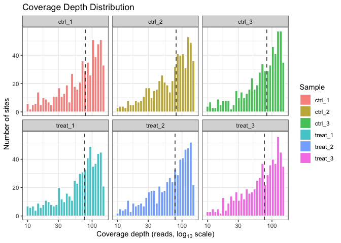
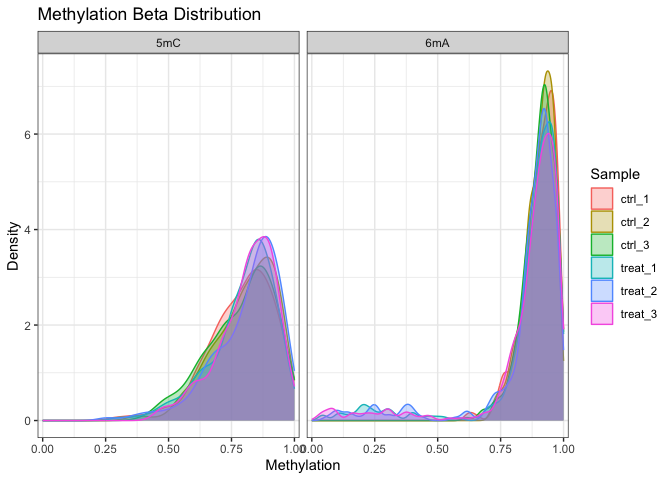
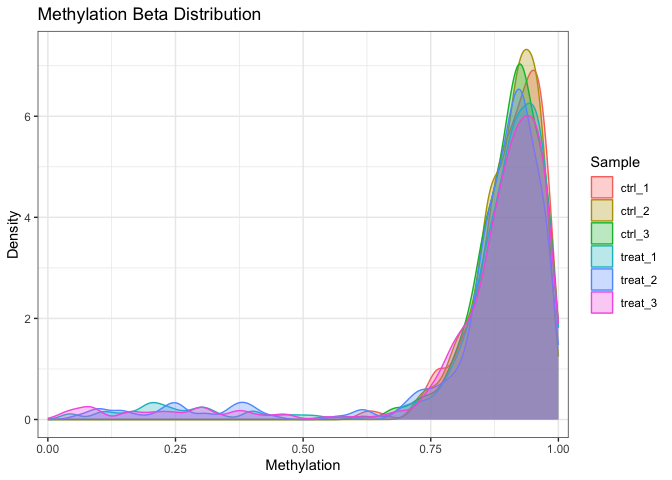
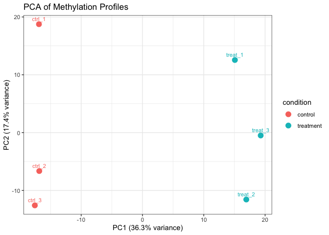
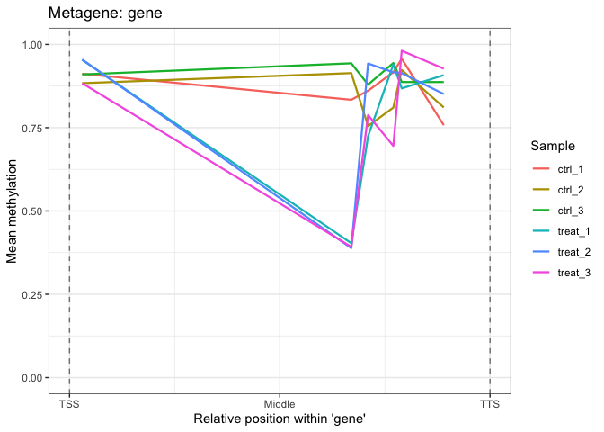
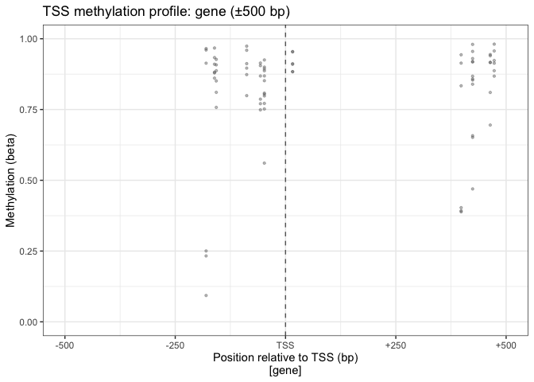
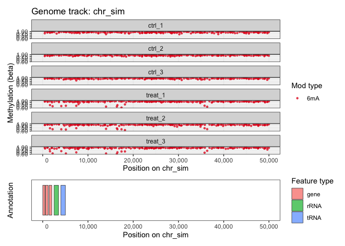
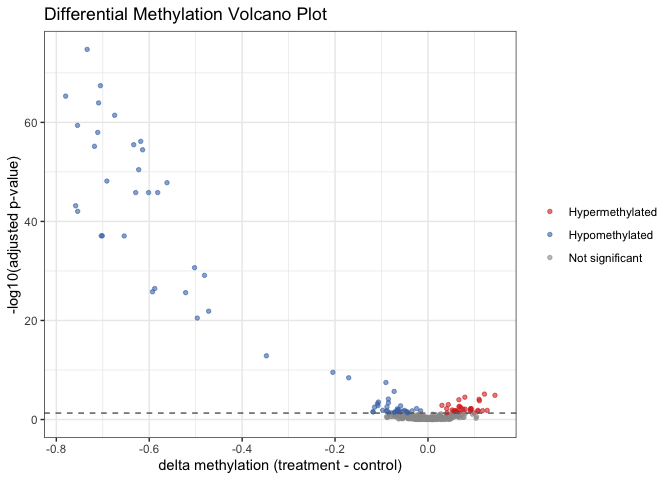
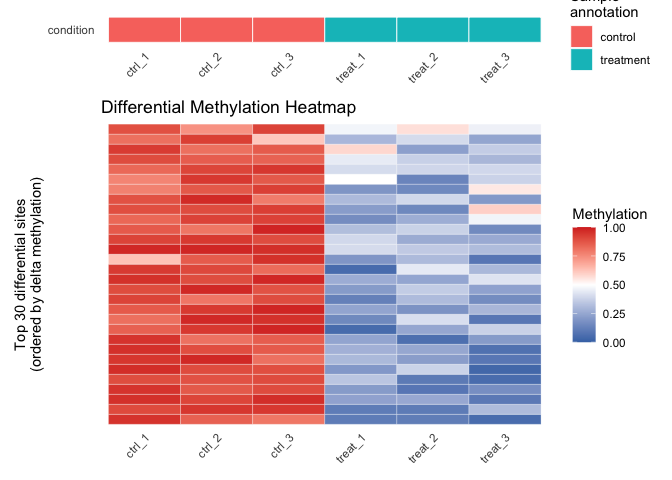

Getting Started with commaKit
================

# Introduction

`commaKit` (**Com**parative **M**icrobial **M**ethylomics **A**nalysis
**Kit**) is an R package for genome-wide analysis of bacterial DNA
methylation from Oxford Nanopore sequencing data. It supports three
modification types — N6-methyladenine (6mA), 5-methylcytosine (5mC), and
N4-methylcytosine (4mC) — in a single, unified data container. This
vignette walks through the complete analysis workflow using the built-in
`comma_example_data` synthetic dataset.

The typical commaKit workflow has six steps:

1.  **Load** per-sample methylation files into a `commaData` object.
2.  **QC** the data (coverage, beta distributions, PCA).
3.  **Annotate** sites relative to genomic features.
4.  **Test** for differential methylation between conditions.
5.  **Visualize** the results.
6.  **Enrich** differentially methylated genes (GO/KEGG).

# Installation

``` r
devtools::install_github("carl-stone/commaKit")
# BiocManager::install("commaKit") after Bioconductor release
```

``` r
library(commaKit)
```

# The `commaData` Object

`commaData` extends Bioconductor’s `RangedSummarizedExperiment` and is
the central data container in commaKit. It stores:

- **methylation** — a sites × samples matrix of beta values (0–1).
- **siteCoverage** — a sites × samples matrix of read depths.
- **rowRanges** — one 1-bp `GRanges` range per methylation site, with
  `mod_type` and `motif` metadata.
- **mod_context** — computed on demand from `mod_type` and `motif` by
  `modContexts()` and `siteInfo()`.
- **colData** — per-sample metadata: sample_name, condition, replicate.
- **Seqinfo** — chromosome names, lengths, and circularity metadata.
- **annotation** — genomic features as a `GRanges` object in
  `metadata()`.
- **motifSites** — motif instances as a `GRanges` object in
  `metadata()`.

The built-in `comma_example_data` contains 588 synthetic methylation
sites (393 × 6mA, 195 × 5mC) on a simulated 100 kb chromosome across six
samples: three controls (`ctrl_1`, `ctrl_2`, `ctrl_3`) and three
treatments (`treat_1`, `treat_2`, `treat_3`).

``` r
data(comma_example_data)
comma_example_data
#> class: commaData
#> sites: 588 | samples: 6
#> mod types: 5mC, 6mA
#> motifs: CCWGG, GATC
#> mod contexts: 5mC_CCWGG, 6mA_GATC
#> conditions: control, treatment
#> genome: 1 chromosome (100,000 bp total)
#> annotation: 5 features
#> motif sites: none
#> caller: modkit
#> min_coverage: 5
```

``` r
# Modification types present
modTypes(comma_example_data)
#> [1] "5mC" "6mA"

# Modification contexts (combines mod_type and motif)
modContexts(comma_example_data)
#> [1] "5mC_CCWGG" "6mA_GATC"

# Per-sample metadata
sampleInfo(comma_example_data)
#>         sample_name condition replicate caller
#> ctrl_1       ctrl_1   control         1 modkit
#> ctrl_2       ctrl_2   control         2 modkit
#> ctrl_3       ctrl_3   control         3 modkit
#> treat_1     treat_1 treatment         1 modkit
#> treat_2     treat_2 treatment         2 modkit
#> treat_3     treat_3 treatment         3 modkit

# Matrix dimensions: sites × samples
dim(methylation(comma_example_data))
#> [1] 588   6
```

# Exploring the Methylome

## Summary Statistics

`methylomeSummary()` returns a tidy data frame with per-sample
distribution statistics:

``` r
ms <- methylomeSummary(comma_example_data)
ms[, c("sample_name", "condition", "mean_beta", "median_beta", "n_covered")]
#>   sample_name condition mean_beta median_beta n_covered
#> 1      ctrl_1   control 0.8654839   0.8929141       588
#> 2      ctrl_2   control 0.8705692   0.8959600       588
#> 3      ctrl_3   control 0.8638033   0.8918851       588
#> 4     treat_1 treatment 0.8357998   0.8864176       588
#> 5     treat_2 treatment 0.8369054   0.8893089       588
#> 6     treat_3 treatment 0.8388398   0.8866568       588
```

## Coverage QC

`plot_coverage()` shows the distribution of sequencing depth per site,
per sample. Consistent coverage across samples is an important quality
indicator.

``` r
plot_coverage(comma_example_data)
```

<figure>

<figcaption aria-hidden="true">Coverage depth distribution per
sample.</figcaption>
</figure>

## Beta Value Distributions

`plot_methylation_distribution()` plots the density of methylation
levels for each sample. Bacterial genomes often show a bimodal
distribution (sites are either fully methylated or unmethylated).

``` r
plot_methylation_distribution(comma_example_data)
```

<figure>

<figcaption aria-hidden="true">Methylation beta value density per
sample, faceted by modification type.</figcaption>
</figure>

Restrict to a single modification type:

``` r
plot_methylation_distribution(comma_example_data, mod_type = "6mA")
```

<figure>

<figcaption aria-hidden="true">Beta value density for 6mA sites
only.</figcaption>
</figure>

## PCA for Sample-Level QC

`plot_pca()` performs PCA on per-sample methylation profiles. Samples
from the same condition should cluster together. Internally, beta values
are converted to M-values via `mValues()` before PCA, which stabilizes
variance across sites near 0 or 1.

``` r
plot_pca(comma_example_data, color_by = "condition")
```

<figure>

<figcaption aria-hidden="true">PCA of methylation profiles colored by
condition.</figcaption>
</figure>

To retrieve the underlying scores for custom plotting, use
`return_data = TRUE`. The result is a `data.frame` with `PC1`, `PC2`,
and all sample metadata columns; the percentage of variance explained by
each PC is stored in `attr(result, "percentVar")`.

``` r
pca_df <- plot_pca(comma_example_data, return_data = TRUE)
attr(pca_df, "percentVar") # variance explained by PC1 and PC2
#>  PC1  PC2
#> 36.3 17.4
```

# Annotating Sites

`annotateSites()` maps methylation sites to genomic features, always
computing four parallel list columns in `rowData`:

- `feature_types` — GFF3 feature type for each association (e.g.,
  `"gene"`, `"promoter"`).
- `feature_names` — feature name for each association.
- `rel_position` — signed distance from the feature (0 = inside;
  negative = upstream; positive = downstream, strand-aware).
- `frac_position` — normalized position within the feature (\[0, 1\];
  `NA` for sites outside).

Use the `keep` argument to filter which associations are retained:
`"all"` (default), `"overlap"` (only overlapping features),
`"proximity"` (retains `rel_position`, drops `frac_position`), or
`"metagene"` (only overlapping features with `frac_position`).

``` r
annotated <- annotateSites(comma_example_data)
si <- siteInfo(annotated)

# Proportion of sites overlapping at least one annotated feature
mean(lengths(si$feature_names) > 0)
#> [1] 0.03401361
```

`plot_metagene()` visualizes the average methylation profile across gene
bodies:

``` r
plot_metagene(comma_example_data, feature = "gene")
```

<figure>

<figcaption aria-hidden="true">Mean methylation profile across gene
bodies (TSS to TTS).</figcaption>
</figure>

## TSS-Centered Profiles

`plot_tss_profile()` shows methylation centered on transcription start
sites, with optional regulatory element coloring:

``` r
plot_tss_profile(comma_example_data, feature_type = "gene")
```

<figure>

<figcaption aria-hidden="true">TSS-centered methylation
profile.</figcaption>
</figure>

# Genome Track Visualization

`plot_genome_track()` produces a genome browser–style plot of
methylation along a chromosome region:

``` r
plot_genome_track(comma_example_data,
  chromosome = "chr_sim",
  start = 1L, end = 50000L, mod_type = "6mA"
)
```

<figure>

<figcaption aria-hidden="true">Genome track for the first 50 kb of
chr_sim.</figcaption>
</figure>

# Differential Methylation

`diffMethyl()` tests each site for differential methylation between
conditions. For v1, pass a one-sided formula with exactly one two-level
comparison variable, such as `~ condition`. Multi-factor formulas
(`~ condition + batch`), interactions, offsets, and continuous
covariates are not interpreted yet; run one two-group comparison per
`diffMethyl()` call. The result is the same object with statistical
results in `rowData` and in the active result layer.

``` r
cd_dm <- diffMethyl(comma_example_data,
  formula = ~condition,
  mod_type = "6mA"
)
cd_dm
#> class: commaData
#> sites: 588 | samples: 6
#> mod types: 5mC, 6mA
#> motifs: CCWGG, GATC
#> mod contexts: 5mC_CCWGG, 6mA_GATC
#> conditions: control, treatment
#> genome: 1 chromosome (100,000 bp total)
#> annotation: 5 features
#> motif sites: none
#> caller: modkit
#> min_coverage: 5
```

## Choosing a Differential Methylation Backend

`diffMethyl()` keeps `method = "methylkit"` as the default for
compatibility with established methylKit workflows and its
logistic-regression conventions. This is a sensible choice when you
already use methylKit elsewhere or want results that use methylKit’s
differential methylation model. commaKit still stores methylKit raw
p-values as `dm_pvalue`, computes `dm_padj` with its genome-wide
adjustment across the full `diffMethyl()` call, and keeps methylKit
q-values separately as `dm_methylkit_qvalue`.

`method = "quasi_f"` is a good general-purpose alternative for bacterial
methylomes. It uses a quasibinomial model with empirical Bayes
dispersion shrinkage and can be a practical first alternative when
methylKit convergence warnings, zero-variance sites, or runtime become
distracting.

`method = "limma"` uses limma’s empirical-Bayes linear model on
M-values. It is most useful when you want a familiar limma workflow on
complete data, especially with only a few replicates per group. All
three backends report `dm_delta_beta` on the original beta scale, so
effect sizes remain comparable even when p-values differ.

Extract the results as a tidy data frame:

``` r
layers <- resultLayers(cd_dm)
layers[, setdiff(colnames(layers), "timestamp")]
#> DataFrame with 1 row and 17 columns
#>          name        role                   type      source is_default
#>   <character> <character>            <character> <character>  <logical>
#> 1  diffMethyl  diffMethyl differential_methyla..  diffMethyl       TRUE
#>        method     formula   reference   treatment     mod_context
#>   <character> <character> <character> <character> <CharacterList>
#> 1   methylkit  ~condition     control   treatment
#>          mod_type           motif p_adjust_method min_coverage     alpha
#>   <CharacterList> <CharacterList>     <character>    <integer> <numeric>
#> 1             6mA                              BH            5       0.5
#>                                 result_cols package_version
#>                             <CharacterList>     <character>
#> 1 dm_pvalue,dm_padj,dm_methylkit_qvalue,...           0.2.0
res <- results(cd_dm)
# Top sites by adjusted p-value
head(res[
  order(res$dm_padj),
  c("chrom", "position", "mod_type", "dm_delta_beta", "dm_padj")
])
#>       chrom position mod_type dm_delta_beta      dm_padj
#> 196 chr_sim    50176      6mA    -0.7336497 1.849154e-75
#> 287 chr_sim    70003      6mA    -0.7050844 3.896483e-68
#> 260 chr_sim    63550      6mA    -0.7799241 5.006897e-66
#> 249 chr_sim    61440      6mA    -0.7090099 1.178364e-64
#> 347 chr_sim    86016      6mA    -0.6743832 3.661541e-62
#> 9   chr_sim     2180      6mA    -0.7543758 4.024452e-60
```

Filter to significant sites (padj \< 0.05, \|Δβ\| ≥ 0.2):

``` r
sig <- filterResults(cd_dm, padj = 0.05, delta_beta = 0.2)
cat("Significant sites:", nrow(sig), "\n")
#> Significant sites: 31
```

## Volcano Plot

`plot_volcano()` displays the differential methylation landscape. Sites
are colored by direction and significance:

``` r
plot_volcano(res)
```

<figure>

<figcaption aria-hidden="true">Volcano plot: effect size (Δβ)
vs. significance (–log10 padj).</figcaption>
</figure>

## Heatmap of Top Sites

`plot_heatmap()` shows methylation beta values for the top
differentially methylated sites:

``` r
plot_heatmap(res, cd_dm, n_sites = 30L)
```

<figure>

<figcaption aria-hidden="true">Heatmap of top 30 differentially
methylated 6mA sites.</figcaption>
</figure>

# Enrichment Analysis

`enrichMethylation()` performs gene set enrichment on differentially
methylated genes. It supports Gene Ontology (GO) and KEGG ontologies,
over-representation analysis (ORA) and gene set enrichment analysis
(GSEA) methods, and distinguishes between target genes (where DM sites
overlap gene bodies) and regulator genes (whose products bind near DM
sites).

## GO Enrichment

Before running enrichment, sites must be annotated with
`annotateSites()`:

``` r
cd_dm <- annotateSites(cd_dm, keep = "overlap")
```

Run GO enrichment on target genes — genes whose bodies overlap
differentially methylated sites:

``` r
# GO Biological Process enrichment on target genes
enr <- enrichMethylation(cd_dm, ont = "BP", gene_role = "target")
# Access results
enr$go
```

## Gene Role Semantics

The `gene_role` argument controls how genes are classified:

- `"target"` — genes whose bodies overlap DM sites. The background
  universe is all genes in the annotation.
- `"regulator"` — genes whose products (e.g., transcription factors)
  bind near DM sites. The background universe is only regulators of that
  type.
- `"both"` — runs both analyses separately and returns a named list.

## KEGG Enrichment (Offline Path)

The KEGG REST API has rate limits. To avoid hitting them, build the
term-to-gene mapping offline and cache it:

``` r
# Build KEGG term2gene mapping (2 API calls, cache to RDS)
kegg_t2g <- buildKEGGTermGene("eco", file = "kegg_eco.rds")

# Build gene ID map: symbol <-> KEGG ID (1 API call)
id_map <- buildKEGGGeneIDMap("eco",
  OrgDb = org.EcK12.eg.db::org.EcK12.eg.db
)

# Run KEGG enrichment with offline mapping
enr_kegg <- enrichMethylation(cd_dm,
  kegg_term2gene = kegg_t2g$term2gene,
  kegg_term2name = kegg_t2g$term2name,
  gene_role = "target"
)
enr_kegg$kegg
```

## GSEA Mode

When you want to rank all genes by their methylation score rather than
using a hard threshold, use GSEA:

``` r
enr_gsea <- enrichMethylation(cd_dm,
  method = "gsea",
  ont = "BP", gene_role = "target"
)
```

# Session Information

``` r
sessionInfo()
```
